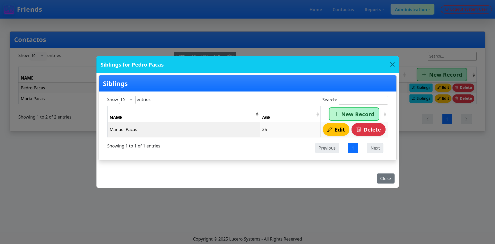

# LST - Lucero Systems Template

> A professional Leiningen template for rapid Clojure web application development

[](https://clojure.org/)
[](https://openjdk.org/)
[](https://leiningen.org/)

---

## 📋 Table of Contents

- [Overview](#overview)
- [Features](#features)
- [Quick Start](#quick-start)
- [Configuration](#configuration)
- [Core Concepts](#core-concepts)
- [Generator Commands](#generator-commands)
- [Database Support](#database-support)
- [Access Control](#access-control)
- [Troubleshooting](#troubleshooting)
- [API Reference](#api-reference)
- [Project File Map](#project-file-map)

---

## 🎯 Overview

**LST** is a powerful Leiningen template that scaffolds full-stack, database-backed Clojure web applications with enterprise-grade features. Generate complete CRUD interfaces, dashboards, and reports in seconds with a consistent MVC architecture.

### What You Get

- **CRUD Grids**: Full Create, Read, Update, Delete interfaces
- **Dashboards**: Read-only data tables with advanced filtering
- **Reports**: Custom report pages with flexible querying
- **Subgrids**: Master-detail relationships with modal interfaces
- **Multi-Database**: MySQL, PostgreSQL, and SQLite support
- **Modern UI**: Bootstrap 5 + DataTables integration
- **Security**: Built-in authentication and authorization

---

## ✨ Features

| Feature | Description | Benefit |
|---------|-------------|---------|
| **Rapid Scaffolding** | Generate complete CRUD in seconds | 🚀 10x faster development |
| **Database Agnostic** | MySQL, PostgreSQL, SQLite support | 🔄 Easy deployment flexibility |
| **Modern UI** | Bootstrap 5 + DataTables | 💎 Professional appearance |
| **Security Built-in** | Role-based access control | 🔒 Enterprise-ready security |
| **Modal Subgrids** | Master-detail relationships | 📊 Rich data relationships |
| **Migration System** | Database versioning | 🔧 Easy schema management |

---

## 🚀 Quick Start

### Prerequisites

| Requirement | Version | Download |
|-------------|---------|----------|
| **Java** | 17+ | [OpenJDK](https://openjdk.org/) |
| **Clojure** | 1.10+ | [Clojure.org](https://clojure.org/) |
| **Leiningen** | 2.9.0+ | [Leiningen.org](https://leiningen.org/) |

### Installation

```bash
# 1. Clone and install the template
git clone <your-repo-url>
cd lst
lein clean && lein deps && lein install
```

```bash
# 2. Create your new application
lein new lst myapp
cd myapp
```

### First Run

```bash
# 3. Configure database (see Configuration section)
# 4. Run migrations and seed data
lein migrate
lein database

# 5. Start the development server
lein with-profile dev run
```

🎉 **Success!** Open http://localhost:3000

---

## ⚙️ Configuration

### Database Configuration

Edit `resources/private/config.clj` with your database credentials:

```clojure
{:connections
 { ;; --- Mysql database ---
  :mysql {:db-type   "mysql"                                 ;; "mysql", "postgresql", "sqlite", etc.
         :db-class  "com.mysql.cj.jdbc.Driver"              ;; JDBC driver class
         :db-name   "//localhost:3306/your_dbname"           ;; JDBC subname (host:port/db)
         :db-user   "root"
         :db-pwd    "your_password"}

  ;; --- Local SQLite database ---
  :sqlite {:db-type   "sqlite"
            :db-class  "org.sqlite.JDBC"
            :db-name   "db/your_dbname.sqlite"}                   ;; No user/pwd needed for SQLite

  ;; --- PostgreSQL database ---
  :postgres {:db-type   "postgresql"
       :db-class  "org.postgresql.Driver"
       :db-name   "//localhost:5432/your_dbname"
       :db-user   "root"
       :db-pwd    "your_password"}

  ;; --- Default connection used by the app ---
  :main :postgres ; Used for migrations
  :default :postgres ; Used for generators (lein grid, lein dashboard, etc.)
  :db :mysql
  :pg :postgres
  :localdb :sqlite}

 ;; --- Other global app settings ---
 :uploads      "./uploads/your_upload_folder/"      ;; Path for file uploads
 :site-name    "your_site_name"                 ;; App/site name
 :company-name "your_company_name"            ;; Company name
 :port         3000                        ;; App port
 :tz           "US/Pacific"                ;; Timezone
 :base-url     "http://0.0.0.0:3000/"      ;; Base URL
 :img-url      "https://0.0.0.0/uploads/"  ;; Image base URL
 :path         "/uploads/"                 ;; Uploads path (for web)
 ;; Optional email config
 :email-host   "smtp.example.com"
 :email-user   "user@example.com"
 :email-pwd    "emailpassword"}

```

> ⚠️ **Important**: Always update `:main` and `:default` to point to your primary database connection. This allows you to run `lein migrate`, `lein grid`, `lein dashboard`, etc. without specifying the database each time. If you only use one database, set both to the same connection key (e.g., `:mysql`, `:postgres`, or `:sqlite`).

### Configuration Sections

| Section | Purpose | Required |
|---------|---------|----------|
| `:connections` | Database connections and defaults | ✅ Yes |
| `:uploads` | File upload directory path | ⚠️ If using file uploads |
| `:site-name` | Application/site name | ⚠️ Recommended |
| `:company-name` | Company name for branding | ⚠️ Recommended |
| `:port` | Application server port | ⚠️ Recommended |
| `:tz` | Application timezone | ⚠️ Recommended |
| `:base-url` | Base URL for the application | ⚠️ Recommended |
| `:img-url` | Base URL for images | ⚠️ If serving images |
| `:path` | Web path for uploads | ⚠️ If using file uploads |
| `:email-*` | SMTP email configuration | ⚠️ If sending emails |

### Database Setup Commands

| Database | Setup Command | Migration Command |
|----------|---------------|-------------------|
| **MySQL** | `CREATE DATABASE mydb CHARACTER SET utf8mb4 COLLATE utf8mb4_unicode_ci;` | `lein migrate db` |
| **PostgreSQL** | `CREATE DATABASE mydb;` | `lein migrate pg` |
| **SQLite** | *Auto-created* | `lein migrate localdb` |

### Default Users

After running `lein database`, these test users are available:

| Email | Password | Role | Access Level |
|-------|----------|------|--------------|
| user@example.com | user | User | Basic access |
| admin@example.com | admin | Admin | Administrative access |
| system@example.com | system | System | Full system access |

---

## 🧠 Core Concepts

### Architecture Overview

```
myapp/
├── src/myapp/
│   ├── handlers/                # Application logic (MVC controllers)
│   │   ├── admin/               # Admin CRUD interfaces (one folder per table)
│   │   ├── reports/             # Custom report handlers
│   │   └── <table>/             # Dashboard/read-only handlers (one per table)
│   ├── models/                  # Database models and seed data
│   │   └── cdb.clj              # Seed/test data definitions
│   ├── routes/
│   │   ├── proutes.clj          # Private (authenticated) routes
│   │   └── routes.clj           # Public (open) routes
│   ├── layout.clj               # Global page layout and shared UI
│   ├── menu.clj                 # Navigation and sidebar menu definitions
│   └── builder/                 # Generator source templates (advanced customization)
└── resources/
    ├── private/
    │   └── config.clj           # Application and database configuration
    └── migrations/              # Database migration SQL scripts
```

#### Why MVC?

LST uses the Model-View-Controller (MVC) pattern to organize your application into clear, modular components:

- **Model**: Handles data access and business logic.
- **View**: Renders the user interface.
- **Controller**: Orchestrates requests, responses, and user actions.

Each grid, dashboard, or report generated by LST gets its own controller, model, and view.  
**This modular approach allows you to:**
- Easily plug any generated grid or feature into any LST-based web app.
- Maintain and extend features independently, without affecting others.
- Assign different database connections to different grids or modules, giving you the flexibility to run parts of your app on different databases while keeping everything integrated.

This structure ensures a clear separation of concerns, making your application scalable, maintainable, and highly flexible for future growth.

---

## 🔧 Generator Commands

### Grid Generator (CRUD)

**Purpose**: Creates full Create, Read, Update, Delete interfaces

By default, all fields are inferred from the database schema.  
**Specifying fields is optional**—only use it to customize labels or limit fields.

```bash
# Basic usage (all fields auto-detected)
lein grid users

# With database connection
lein grid pg customers

# With access restrictions
lein grid orders :rights [A S]

# (Optional) Specify fields and labels
lein grid products "Product Name:name" "Price:price" "Category:category_id"
```

**Generated Files**:
- `src/myapp/handlers/admin/<table>/controller.clj`
- `src/myapp/handlers/admin/<table>/model.clj`
- `src/myapp/handlers/admin/<table>/view.clj`

---

### Dashboard Generator (Read-Only)

**Purpose**: Creates read-only data tables

By default, all fields are inferred from the database schema.  
**Specifying fields is optional**.

```bash
# Basic usage (all fields auto-detected)
lein dashboard products

# With access restrictions
lein dashboard users :rights [S]

# (Optional) Specify fields and labels
lein dashboard users "Name:firstname" "Email:email" "Joined:created_at"
```

**Generated Files**:
- `src/myapp/handlers/<table>/controller.clj`
- `src/myapp/handlers/<table>/model.clj`
- `src/myapp/handlers/<table>/view.clj`

---

### Report Generator

**Purpose**: Creates custom report pages

By default, all fields are inferred from the database schema.  
**Specifying fields is optional**.

```bash
# Basic usage (all fields auto-detected)
lein report monthlySales

# With access restrictions
lein report userActivity :rights [A S]

# With database connection
lein report pg inventoryReport :set-default
```

**Generated Files**:
- `src/myapp/handlers/reports/<name>/controller.clj`
- `src/myapp/handlers/reports/<name>/model.clj`
- `src/myapp/handlers/reports/<name>/view.clj`

---

### Subgrid Generator (Master-Detail)

**Purpose**: Creates child grids linked to parent records

By default, all fields are inferred from the database schema.  
**Specifying fields is optional**.

```bash
# Basic usage (all fields auto-detected)
lein subgrid order_items orders order_id

# With access restrictions
lein subgrid user_addresses users user_id :rights [A]

# (Optional) Specify fields and labels
lein subgrid order_items orders order_id "Product:product_name" "Qty:quantity"
```

**Requirements**:
- Parent table must have primary key `id`
- Child table must have foreign key to parent
- Child table must have primary key `id`

#### Example Subgrid UI


*Example: A subgrid showing sibling items within an contactos.*

---

## 🗄️ Database Support

### Supported Databases

| Database | Driver | Connection Key | Production Ready |
|----------|--------|----------------|------------------|
| **MySQL** | `com.mysql.cj.jdbc.Driver` | `db` | ✅ Yes |
| **PostgreSQL** | `org.postgresql.Driver` | `pg` | ✅ Yes |
| **SQLite** | `org.sqlite.JDBC` | `localdb` | ⚠️ Development |

### Migration Commands

| Command | Purpose | Example |
|---------|---------|---------|
| `lein migrate [conn]` | Run pending migrations | `lein migrate pg` |
| `lein rollback [conn]` | Rollback last migration | `lein rollback` |
| `lein database [conn]` | Seed test data | `lein database localdb` |

### Migration Files

Migrations are database-specific and located in `resources/migrations/`:

```
resources/migrations/
├── 001-initial.mysql.up.sql
├── 001-initial.postgresql.up.sql
├── 001-initial.sqlite.up.sql
├── 002-users.mysql.up.sql
└── ...
```

---

## 🔐 Access Control

### Setting Access Rights

```bash
# Admin and System only
lein grid sensitive_data "Data:value" :rights [A S]

# System only
lein dashboard system_logs "Time:timestamp" "Message:message" :rights [S]

# All authenticated users (default)
lein dashboard public_info "Title:title" "Content:content"
```

### Implementation

Generated controllers automatically check user permissions:

```clojure
(defn handler [request]
  (if (auth/has-rights? (:session request) [:A :S])
    (render-page request)
    (response/redirect "/unauthorized")))
```

---

## 🔗 Integrating Subgrids

### Manual Integration Example

After generating a subgrid, integrate it into the parent view:

```clojure
(ns myapp.handlers.admin.users.view
  (:require [myapp.models.grid :refer [build-grid-with-subgrids create-subgrid-config]]))

(defn users-view [title rows]
  (let [labels ["Name" "Email"]
        db-fields [:firstname :email]
        fields (apply array-map (interleave db-fields labels))
        table-id "users_table"
        href "/admin/users"
        args {:new true :edit true :delete true
              :subgrids [(create-subgrid-config
                           {:title "User Contacts"
                            :table-name "user_contacts"
                            :foreign-key "user_id"
                            :href "/admin/usercontactsusers"
                            :icon "bi bi-people"
                            :label "Contacts"})]}]
    (build-grid-with-subgrids title rows table-id fields href args)))
```

---

## 🐛 Troubleshooting

### Common Issues

| Problem | Cause | Solution |
|---------|-------|----------|
| **Generated components not showing** | Server needs to reload routes | Open `src/myapp/core.clj`, save it (no changes needed), then refresh webpage |
| **Routes not updating** | Server cache | Restart dev server with `lein with-profile dev run` |
| **Database connection error** | Wrong credentials | Check `resources/private/config.clj` |
| **Subgrid not opening** | Missing foreign key | Verify FK exists in child table |
| **Permission denied** | Wrong user role | Check `:rights` setting in generator |
| **Migration failed** | SQL syntax error | Check database-specific SQL files |

### Debug Commands

```bash
# Check database connection
lein repl
=> (require '[myapp.db :as db])
=> (db/test-connection :db)

# Verify routes
=> (require '[myapp.routes.proutes :as routes])
=> (routes/app-routes)

# Test authentication
=> (require '[myapp.auth :as auth])
=> (auth/has-rights? {:user {:role "A"}} [:A :S])
```

---

## 📚 API Reference

### Quick Command Reference

#### Grid Commands
```bash
lein grid <table> "Label:field" ...                    # Basic CRUD
lein grid pg <table> "Label:field" ... :set-default    # PostgreSQL + save default
lein grid <table> "Label:field" ... :rights [A S]      # Restricted access
```

#### Dashboard Commands
```bash
lein dashboard <table> "Label:field" ...               # Read-only table
lein dashboard <table> "Label:field" ... :rights [S]   # System access only
```

#### Report Commands
```bash
lein report <name>                                      # Basic report
lein report <name> :rights [A S]                       # Admin/System only
```

#### Subgrid Commands
```bash
lein subgrid <child> <parent> <fk> "Label:field" ...   # Master-detail
lein subgrid <child> <parent> <fk> :rights [A]         # Admin only
```

### Database Operations

| Command | Description |
|---------|-------------|
| `lein migrate [conn]` | Apply pending migrations |
| `lein rollback [conn]` | Rollback last migration |
| `lein database [conn]` | Seed test data |

### Connection Keys

| Key | Database | Usage |
|-----|----------|-------|
| `db` | MySQL | Default production |
| `pg` | PostgreSQL | Alternative production |
| `localdb` | SQLite | Development/testing |

---

## 🗂️ Project File Map

A quick reference for where to find and update everything in your generated LST app.

| Feature/Area      | Location(s)                                                                 | Purpose / What to Edit                                  |
|-------------------|-----------------------------------------------------------------------------|---------------------------------------------------------|
| **CRUD Grids**    | `src/myapp/handlers/admin/<table>/`                                         | Controllers, models, and views for admin CRUD           |
| **Dashboards**    | `src/myapp/handlers/<table>/`                                               | Read-only table controllers, models, and views          |
| **Reports**       | `src/myapp/handlers/reports/<name>/`                                        | Custom report controllers, models, and views            |
| **Subgrids**      | `src/myapp/handlers/admin/<child>/`<br>`src/myapp/handlers/admin/<parent>/` | Child grid logic and parent integration                 |
| **Menus**         | `src/myapp/menu.clj`                                                        | Update navigation and sidebar links                     |
| **App Layout**    | `src/myapp/layout.clj`                                                      | Change global page layout and shared UI                 |
| **Routing**       | `src/myapp/routes/`                                                         | URL routing for all features                            |
| **Config**        | `resources/private/config.clj`                                              | Database and global app settings                        |
| **Seed Data**     | `src/myapp/models/cdb.clj`                                                  | Add/edit initial data for `lein database`               |
| **Migrations**    | `resources/migrations/`                                                     | SQL files for schema changes                            |
| **Builder Templates** | `src/myapp/builder/`                                                    | Source templates for code generators (advanced)         |

### 🔎 Quick Tips

- **Add a new menu item?** Edit `src/myapp/menu.clj`.
- **Change database config?** Edit `resources/private/config.clj`.
- **Seed or update test data?** Edit `src/myapp/models/cdb.clj`.
- **Customize generated UI?** Edit files in the relevant handler directory.
- **Change how generators scaffold code?** Advanced: edit builder templates in `src/myapp/builder/`.

---

## 🤝 Contributing

1. Fork the repository
2. Create a feature branch
3. Make your changes
4. Add tests
5. Submit a pull request

## 📄 License

This project is licensed under the MIT License - see the LICENSE file for details.

---

## 🔗 Resources

- [Leiningen Documentation](https://leiningen.org/)
- [Clojure Documentation](https://clojure.org/)
- [Bootstrap 5 Documentation](https://getbootstrap.com/docs/5.0/)
- [DataTables Documentation](https://datatables.net/)

---

*Generated with ❤️ by LST - Lucero Systems Template*
